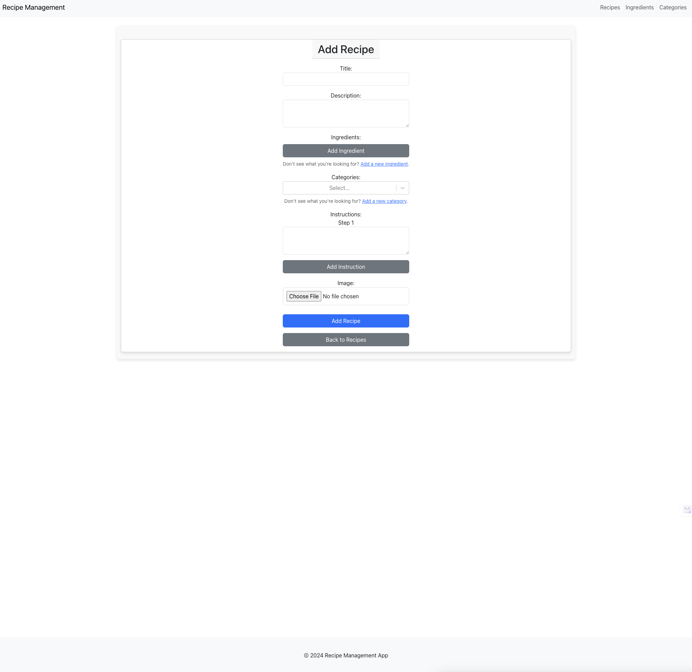
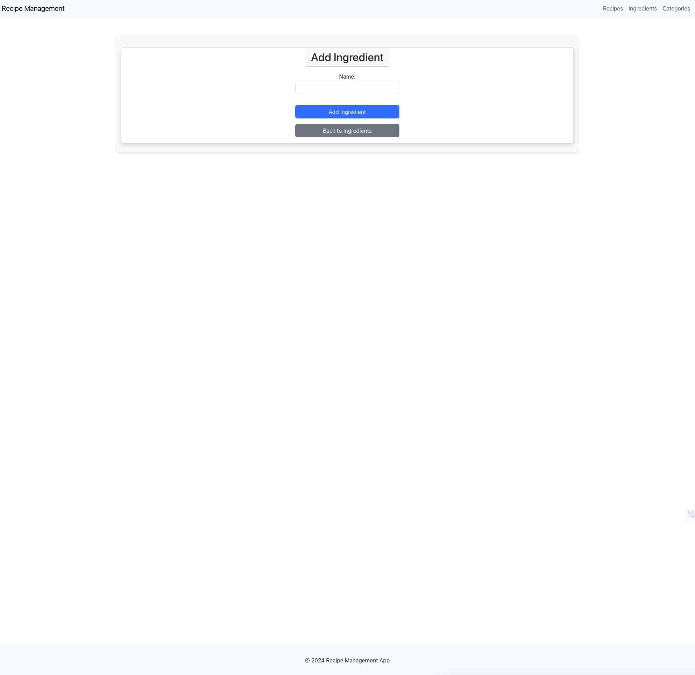

# Recipe Management App

## Introduction

The Recipe Management App is a full-stack web application designed to help users manage their recipes, ingredients, and categories. Users can add, edit, and delete recipes, organize them into categories, and maintain an inventory of ingredients.

## Features

- **Recipe Management**: Add, edit, delete, and view recipes.
- **Ingredient Management**: Add, edit, delete, and view ingredients.
- **Category Management**: Add, edit, delete, and view categories.
- **Recipe Search**: Search for recipes using keywords.
- **Recipe Carousel**: Display featured recipes in a carousel on the home page.

## Technologies Used

### Frontend

- React.js
- React Router
- React Select
- Bootstrap
- Axios

### Backend

- Django
- Django REST Framework
- PostgreSQL

### Other Tools

- Docker
- Git
- GitHub
- AWS S3 (for frontend deployment)
- AWS EC2 (for backend deployment)

## API Endpoints

- see apis 

## Screenshots

### Home Page

### Recipe List

### Recipe Form

### Ingredient List

### Ingredient Form

### Category List

### Category Form

## Links

- [Frontend and Backend Repository](https://github.com/)
- [Deployed Application](http://emmy-recipe-app.s3-website-us-east-1.amazonaws.com/)
- [APIs](http://emmy-app-demo-dev.us-east-1.elasticbeanstalk.com/api/)
